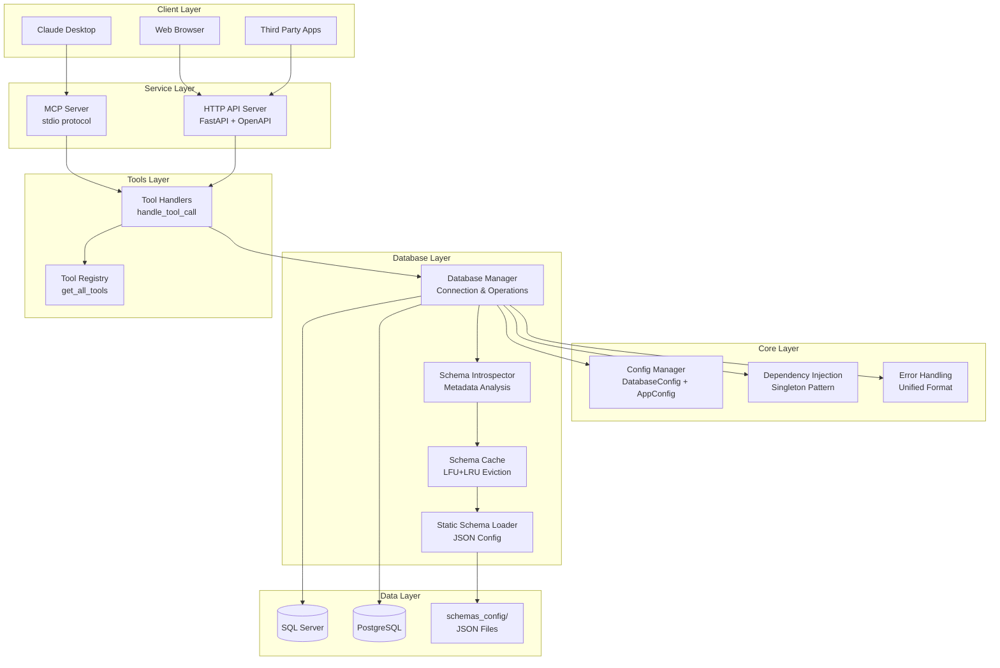
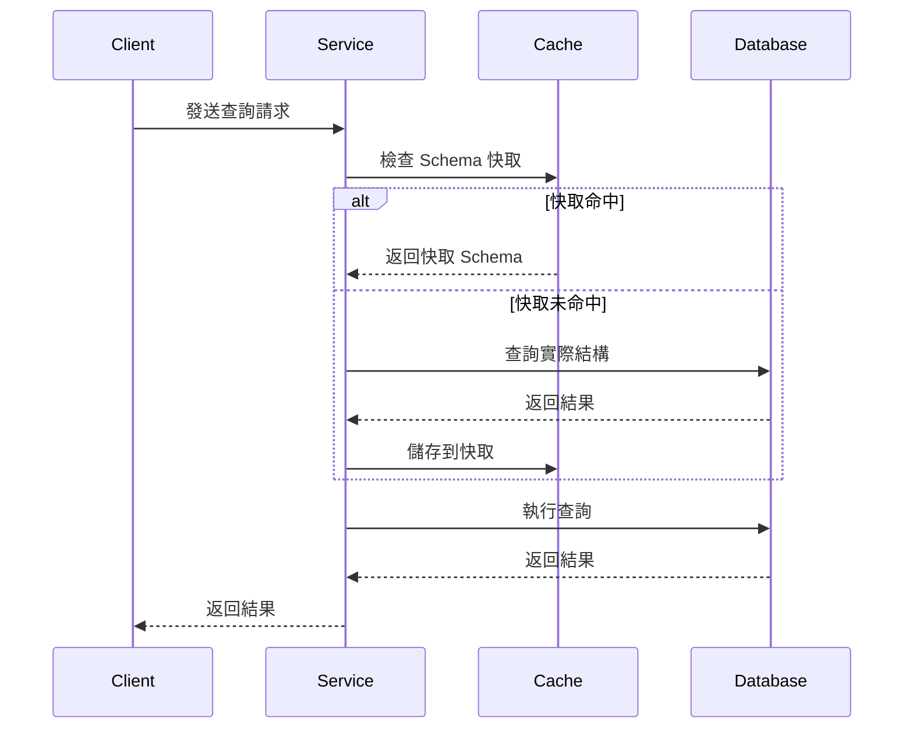
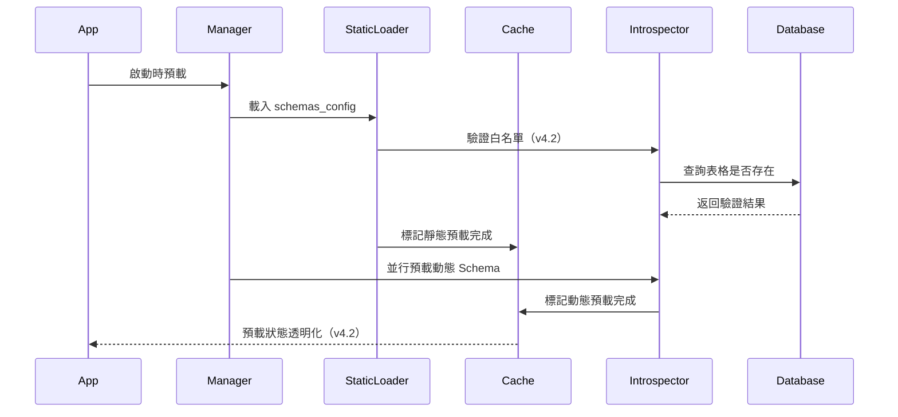
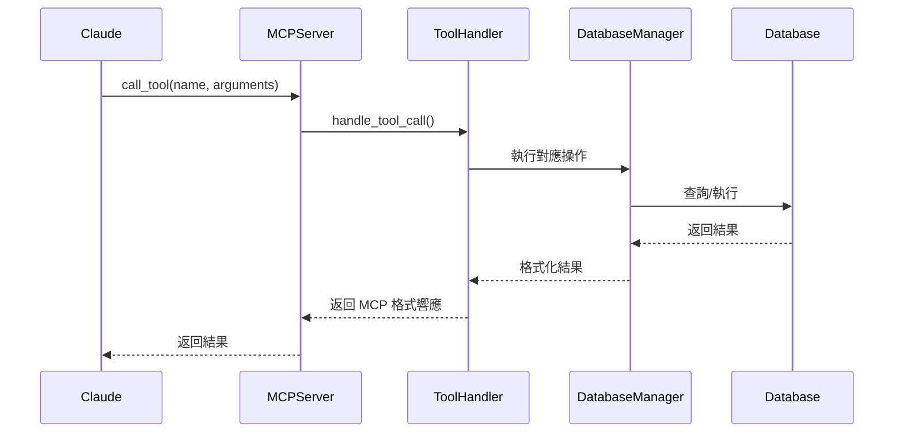

# 🏗️ 系統架構

MCP Multi-Database Connector 採用分層模組化設計，提供靈活且可擴展的多資料庫連接解決方案。本文件詳細說明架構設計、核心模組與資料流程。

## 📊 總體架構



## 🎯 設計原則 (v4.2.0)

### 1. 分層架構 (Layered Architecture)
- **核心層 (core/)**: 配置管理、依賴注入、異常處理
- **數據庫層 (database/)**: 連接管理、Schema 快取與內省
- **工具層 (tools/)**: MCP 工具註冊和處理
- **MCP 層 (mcp/)**: 協議實現（STDIO/SSE 傳輸）
- **API 層 (api/)**: REST API 路由和中間件

### 2. 雙模式支援
- **MCP Protocol (stdio)**: 專為 Claude Desktop 設計
- **HTTP API (OpenAPI)**: 支援 Open WebUI 和第三方應用整合
- **統一工具層**: MCP 和 HTTP API 共用相同的工具邏輯

### 3. 關注點分離 (Separation of Concerns)
- 每個層次有明確的職責邊界
- 避免跨層直接依賴
- 通過依賴注入解耦

### 4. 效能最佳化
- **智能快取**: LFU+LRU 混合淘汰策略
- **並行預載**: ThreadPoolExecutor 預載 Schema
- **異步架構**: 支援並發查詢執行

### 5. 通用化設計
- **零硬編碼**: 完全基於 schemas_config 的業務邏輯
- **動態適配**: 自動適應不同資料庫結構
- **可擴展性**: 易於添加新的資料庫支援

---

## 🧱 v4.2.0 分層架構詳解

### 1️⃣ 核心層 (core/)

#### 📋 config.py
**職責**: 配置管理

```python
class DatabaseConfig:
    """資料庫連接配置"""
    db_type: str        # mssql | postgresql
    host: str
    port: int
    database: str
    username: str
    password: str
    trust_server_certificate: bool

class SchemaConfig:
    """Schema 系統配置"""
    enable_cache: bool
    cache_ttl_minutes: int
    enable_static_preload: bool
    strict_mode: bool

class AppConfig:
    """應用程式配置"""
    expose_sensitive_info: bool
    max_concurrent_queries: int
    query_timeout_seconds: int
```

#### 🔌 dependencies.py
**職責**: 依賴注入（單例模式）

```python
# 單例模式的配置管理器
def get_app_config() -> AppConfig
def get_database_config() -> DatabaseConfig

# 單例模式的數據庫管理器
def get_database_manager() -> DatabaseManager
```

#### ⚠️ exceptions.py
**職責**: 自定義異常

```python
class MCPDBError(Exception)              # 基礎異常
class DatabaseConnectionError(...)       # 連接錯誤
class SchemaLoadError(...)               # Schema 載入錯誤
class ToolExecutionError(...)            # 工具執行錯誤
```

#### 🛡️ error_handling.py
**職責**: 統一錯誤處理

```python
def format_error_response(
    error: Exception,
    format_type: ErrorFormat = ErrorFormat.MCP_TOOL
) -> dict

def safe_execute(func: Callable, *args, **kwargs) -> dict
def safe_execute_async(func: Callable, *args, **kwargs) -> dict
```

---

### 2️⃣ 數據庫層 (database/)

#### 🗄️ manager.py - DatabaseManager
**職責**: 統一的資料庫管理入口

```python
class DatabaseManager:
    """資料庫連接和操作管理"""

    def __init__(config: DatabaseConfig, app_config: AppConfig)

    # 連接管理
    def get_connection()  # 上下文管理器
    def test_connection()

    # 查詢執行
    def execute_query(query: str, params: List = None)
    def execute_command(command: str, params: List = None)

    # Schema 操作
    def get_schema_info(table_name: Optional[str] = None)
    def get_table_dependencies(table_name: str)
    def get_schema_summary()

    # 快取管理
    def invalidate_schema_cache(table_name: Optional[str] = None)
```

#### 🔌 connectors.py
**職責**: 資料庫連接器

```python
def create_database_connector(config: DatabaseConfig)

class MSSQLConnector(DatabaseConnector):
    """SQL Server 連接器"""

class PostgreSQLConnector(DatabaseConnector):
    """PostgreSQL 連接器"""
```

#### 📊 database/schema/ 子系統

##### cache.py - SchemaCache
**職責**: Schema 快取系統（LFU+LRU）

```python
class SchemaCache:
    """智能快取 - LFU+LRU 混合淘汰"""

    def __init__(max_size: int, default_ttl: int)

    # 基本操作
    def get(key: str) -> Optional[Any]
    def set(key: str, value: Any, ttl: Optional[int] = None)
    def invalidate(pattern: str = None) -> int

    # 預載追蹤 (v4.2 新增)
    def mark_static_preload_complete(table_names: List[str])
    def mark_dynamic_preload_complete(table_names: List[str])
    def get_preload_status() -> Dict[str, Any]
    def is_table_preloaded(table_name: str) -> Dict[str, bool]

    # 統計
    def get_stats() -> Dict[str, Any]
```

**特點**：
- ⏱️ TTL (Time To Live) 自動過期
- 📈 LFU+LRU 混合淘汰策略
- 📊 快取命中率統計
- 🔍 預載狀態透明化（v4.2）

##### introspector.py - SchemaIntrospector
**職責**: 資料庫內省（查詢實際結構）

```python
class SchemaIntrospector:
    """資料庫 Schema 分析器"""

    def get_schema_info(table_name: str = None) -> Dict[str, Any]
    def get_table_dependencies(table_name: str) -> Dict[str, Any]
    def export_table_schema(table_name: str, output_dir: str) -> str
    def get_schema_summary() -> Dict[str, Any]
```

##### static_loader.py - StaticSchemaLoader
**職責**: JSON 配置載入

```python
class StaticSchemaLoader:
    """靜態 Schema 載入器（JSON 配置）"""

    def load_schemas_config() -> Dict[str, Any]
    def get_table_schema(table_name: str) -> Optional[Dict]
    def validate_whitelist(introspector: SchemaIntrospector)  # v4.2 新增
```

##### formatter.py
**職責**: Schema 格式化（用於顯示）

---

### 3️⃣ 工具層 (tools/)

#### 🎛️ registry.py
**職責**: 工具註冊中心

```python
def get_all_tools() -> List[Tool]
    """返回所有可用的 MCP 工具"""

def get_tool_by_name(name: str) -> Tool
    """根據名稱獲取特定工具"""
```

**工具清單**（10+ 工具）：
- `db_test_connection` - 測試資料庫連接
- `db_query` - 執行 SQL 查詢
- `db_schema` - 取得 Schema 資訊
- `db_list_tables` - 列出所有表格
- `db_dependencies` - 分析表格依賴關係
- `db_cache_stats` - 快取統計
- `db_export_schema` - 匯出 Schema
- ... 等

#### 🔧 handlers.py
**職責**: 統一的工具處理邏輯

```python
async def handle_tool_call(
    request: CallToolRequest,
    db_manager: Optional[DatabaseManager] = None
) -> dict:
    """統一的工具處理入口（MCP 和 HTTP API 共用）"""
```

---

### 4️⃣ MCP 協議層 (mcp/)

#### 🎯 base_server.py - BaseMCPServer
**職責**: 傳輸無關的 MCP 服務器基礎實現

```python
class BaseMCPServer:
    """傳輸無關的 MCP 協議實現"""

    def __init__(db_manager: DatabaseManager, server_name: str)

    def _setup_handlers(self):
        """設置 MCP 協議處理器"""
        @self.server.list_tools()
        @self.server.call_tool()
        @self.server.list_prompts()
        @self.server.list_resources()
```

#### 🖥️ stdio_server.py - StdioMCPServer
**職責**: STDIO 傳輸（Claude Desktop）

```python
class StdioMCPServer(BaseMCPServer):
    """STDIO 傳輸的 MCP 服務器"""

    async def run(self):
        """使用 stdio_server() 上下文管理器"""
```

#### 🌐 sse_server.py - SseMCPServer
**職責**: HTTP/SSE 傳輸

```python
class SseMCPServer(BaseMCPServer):
    """HTTP/SSE 傳輸的 MCP 服務器"""

    def create_asgi_app(allowed_origins: List[str] = None):
        """創建帶有 CORS 支持的 ASGI 應用"""
```

**CORS 支持**（v4.2 改進）：
- 處理 OPTIONS 預檢請求
- 注入 CORS headers
- 解決子應用掛載問題

---

### 5️⃣ API 層 (api/)

#### 🛣️ routes.py
**職責**: REST API 端點定義

```python
router = APIRouter(prefix="/api/v1")

@router.get("/health")               # 健康檢查
@router.get("/tools")                # 工具列表（使用 tools.get_all_tools()）
@router.get("/schema")               # Schema 資訊
@router.post("/query")               # 執行查詢
@router.post("/execute")             # 執行命令
@router.post("/cache/invalidate")    # 清除快取
```

#### 🎨 middleware.py
**職責**: 中間件配置

```python
def setup_middleware(app: FastAPI, config: AppConfig):
    """配置 CORS、日誌、限流等中間件"""
```

---

## 🔄 統一入口點 (main.py)

```python
async def run_stdio_mode():
    """STDIO 模式（用於 MCP 客戶端）"""
    db_manager = DatabaseManager.create_with_preload()
    from mcp.stdio_server import run_stdio_server
    await run_stdio_server()

async def run_http_mode(host: str, port: int):
    """HTTP 模式（REST API + SSE MCP）"""
    # 創建 FastAPI 應用
    # 設置中間件
    # 註冊 REST API 路由
    # 掛載 SSE MCP 端點
    # 添加優雅關閉處理器
    await server.serve()

def main():
    """主入口點，支援參數解析"""
    if args.http:
        asyncio.run(run_http_mode(host, port))
    else:
        asyncio.run(run_stdio_mode())
```

---

## schemas_config Customization Architecture

### Three-Layer Knowledge Injection

```
schemas_config/
├── global_patterns.json     # Global pattern matching
│   ├── _ID$ → "Identifier"
│   ├── _DATE$ → "Date"
│   └── _AMT$ → "Amount"
│
├── tables/*.json            # Table business logic
│   ├── Column descriptions
│   ├── Status value definitions
│   ├── Key field markers
│   └── Common query scenarios
│
├── ai_enhancement.json      # AI enhancement config
│   ├── Keyword mappings
│   ├── Query pattern templates
│   └── Optimization hints
│
└── tables_list.json         # Main configuration
```

### Benefits
- **60-80% token savings**: Compressed Schema descriptions
- **90%+ first-query accuracy**: AI generates correct SQL directly
- **Millisecond responses**: Dual-layer cache (dynamic TTL + static JSON)

---

## 📊 資料流程

### 1. 查詢執行流程



### 2. Schema 載入流程（v4.2 改進）



### 3. MCP 工具調用流程



---

## 🚀 效能考量

### 1. 快取策略（v4.2 改進）
- **LFU+LRU 混合淘汰**: 結合訪問頻率和最近使用
- **TTL 自動過期**: 可配置的過期時間
- **預載優化**: 啟動時並行預載熱門 Schema
- **預載追蹤**: 透明的預載狀態查詢（v4.2）

### 2. 異步架構（階段 1+2 完成）
- **AsyncDatabaseManager**: 異步查詢執行
- **HybridDatabaseManager**: 雙介面（同步+異步）
- **並發查詢**: 支援多個同時查詢（最大 5 個）
- **連接池**: 異步連接池管理

### 3. 智能優化
- **Schema 壓縮**: 60-80% token 節省
- **Strict Mode**: 僅允許預配置表格，防止意外查詢
- **來源追蹤**: cache_source 字段標記數據來源（v4.2）

---

## 🔒 安全性架構

### 1. 資料庫安全
- **最小權限**: 僅授予 SELECT 權限（只讀模式）
- **參數化查詢**: 防止 SQL 注入攻擊
- **SQL 驗證**: 拒絕 DELETE/DROP/INSERT 等危險語句
- **連線加密**: 支援 SSL/TLS 加密連線

### 2. API 安全
- **輸入驗證**: Pydantic 模型驗證
- **錯誤處理**: 統一錯誤格式，避免敏感資訊洩露（v4.2）
- **CORS 配置**: 可配置的跨域存取控制
- **敏感資訊保護**: `expose_sensitive_info` 控制（v4.2）

### 3. 配置安全
- **環境變數**: 使用 .env 存儲敏感資訊
- **JSON 配置**: schemas_config 不包含密碼
- **日誌安全**: 自動過濾 server/port/driver 資訊

---

## 🔄 擴展性設計

### 1. 新資料庫支援
```python
# 添加新的資料庫類型
class NewDatabaseConnector(DatabaseConnector):
    def get_connection(self) -> Any
    def execute_query(self, query: str) -> List[Dict]
    def get_schema_info(self, table_name: str) -> Dict
```

### 2. 新 MCP 傳輸層支援
```python
# 添加新的傳輸實現
class WebSocketMCPServer(BaseMCPServer):
    async def run(self):
        # WebSocket 傳輸邏輯
```

### 3. 新工具支援
```python
# 在 tools/registry.py 中註冊新工具
new_tool = Tool(
    name="db_new_feature",
    description="...",
    inputSchema={...}
)
```

---

## 📈 監控和維護

### 1. 健康檢查
```python
@app.get("/health")
async def health_check():
    return {
        "status": "healthy",
        "database": await db_manager.test_connection(),
        "cache": cache.get_stats(),
        "preload_status": cache.get_preload_status(),  # v4.2
        "timestamp": datetime.now().isoformat()
    }
```

### 2. 快取監控
```python
cache.get_stats()
# {
#     "size": 50,
#     "max_size": 100,
#     "hit_rate": 0.85,
#     "total_hits": 1200,
#     "total_misses": 200
# }
```

### 3. 預載狀態（v4.2 新增）
```python
cache.get_preload_status()
# {
#     "static_preload_completed": True,
#     "dynamic_preload_completed": True,
#     "static_tables_count": 10,
#     "dynamic_tables_count": 15,
#     "total_tables": 25,
#     "preload_timestamp": "2025-12-30T10:30:00"
# }
```

---

## 🔗 v4.2.0 架構改進總結

### 關鍵改進
1. ✅ **分層架構重構** - 清晰的職責劃分（core/database/tools/mcp/api）
2. ✅ **Strict Mode 改進** - cache_source 來源追蹤
3. ✅ **預載邏輯同步** - 預載狀態透明化
4. ✅ **白名單驗證** - 靜態 Schema 驗證是否存在於資料庫
5. ✅ **CORS 支持** - SSE 子應用 CORS 完整實現
6. ✅ **統一錯誤處理** - REST API 和 MCP 工具格式統一
7. ✅ **依賴注入** - 單例模式的配置和管理器
8. ✅ **優雅關閉** - 自動清理資源

---

> **相關文件**：
> - [v4.2 架構重構詳解](development/v4.2-architecture-refactoring.md) — 完整重構文件
> - [Schema 系統](schema-system.md) — schemas_config 配置系統
> - [效能優化](performance.md) — 快取與 Token 優化策略
> - [測試指南](testing.md) — 單元測試與覆蓋率報告

**最後更新**：2026-01-27
**版本**：v5.0.0
