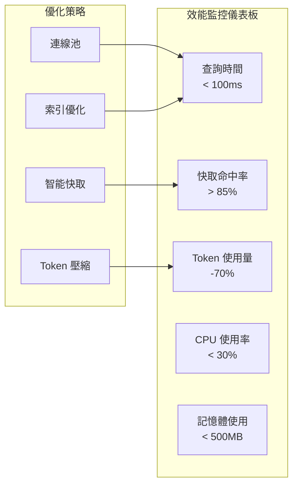

# ⚡ 效能優化指南

MCP Multi-Database Connector 內建多層次的效能優化機制，包括智慧快取、Token 優化、連線池管理等。本指南將幫助您最大化系統效能。

## 🎯 效能優化概述

### 主要優化領域
- 🧠 **AI Token 優化**: 60-80% token 使用量減少
- 💾 **智能快取系統**: 毫秒級 Schema 查詢回應
- 🔌 **連線池管理**: 減少資料庫連線開銷
- 📊 **Query 優化**: 智能查詢計劃和索引建議
- 🚀 **延遲載入**: 按需載入減少啟動時間

### 效能指標監控


---

## 🧠 AI Token 優化 (v3.0)

### Token 優化架構
MCP Multi-Database Connector v3.0 引入革命性的 Token 優化系統，大幅降低 Claude API 成本。

#### 優化前後對比
| 組件 | 優化前 | 優化後 | 節省率 |
|------|--------|--------|--------|
| **Schema 格式化** | 3000-8000 tokens | 500-1500 tokens | 75% |
| **System Prompt** | 800 tokens | 200 tokens | 75% |
| **查詢結果** | 2000-10000 tokens | 500-2000 tokens | 70% |
| **總計** | 5800-18800 tokens | 1200-3700 tokens | **60-80%** |

### SchemaOptimizer 使用
```python
from src.database.schema.claude_client import SchemaOptimizer

# 壓縮 Schema 資訊
compressed_schema = SchemaOptimizer.compress_schema_for_sql_generation(
    schema_info=enhanced_schema,
    query_context="query this month's orders額",
    max_tables=8,           # 限制表格數量
    max_columns_per_table=6  # 限制每表格欄位數
)

# 壓縮效果：3000+ tokens → 500 tokens
print(f"壓縮後 Schema 長度: {len(compressed_schema)} 字符")
```

### DataCompressor 使用
```python
from src.database.schema.claude_client import DataCompressor

# 壓縮查詢結果
compressed_results = DataCompressor.compress_query_results(
    results=large_result_set,
    max_rows=10,              # 取樣行數
    max_chars_per_field=50    # 欄位字符限制
)

# 包含統計摘要和趨勢分析
print(f"原始: {len(large_result_set)} 行")
print(f"壓縮: {compressed_results['total_count']} 行 → {len(compressed_results['sample_rows'])} 行樣本")
```

### 智能選擇策略
```python
# 自動選擇優化模式
sql = await client.smart_generate_sql(
    natural_query="query this month's orders前10名商品",
    schema_info=schema_info,
    optimize_tokens=True  # 根據 Schema 大小自動選擇
)

# 系統會自動判斷：
# - Schema > 50 欄位 或 > 5 表格 → 使用優化模式
# - 否則使用標準模式保持完整性
```

---

## 💾 智能快取系統

### 多層次快取架構
```python
# L1: LRU 快取 (記憶體)
@lru_cache(maxsize=100)
def get_table_schema(table_name: str) -> Dict:
    # 最近使用的 100 個表格 Schema

# L2: TTL 快取 (時間過期)
class SchemaCache:
    def __init__(self, default_ttl: int = 3600):
        self.cache = {}
        self.ttl = default_ttl

# L3: 預載快取 (啟動時)
preload_tables = ["ORDERS", "PRODUCTS", "CUSTOMERS"]
```

### 快取配置選項
```bash
# .env 檔案配置
SCHEMA_ENABLE_CACHE=true
SCHEMA_CACHE_TTL_MINUTES=60
SCHEMA_PRELOAD_ON_STARTUP=true
SCHEMA_CACHE_MAX_SIZE=100
SCHEMA_LAZY_LOADING=true
```

### 快取效能監控
```python
from src.database.schema.static_schemas import get_schema_manager

manager = get_schema_manager()
summary = manager.get_summary()

# 檢查快取狀態
cache_status = summary['performance']
print(f"""
快取狀態:
- 已載入: {cache_status['loaded']}
- 快取項目: {cache_status['cached_schemas']}
- 記憶體使用: ~{cache_status['cached_schemas'] * 0.15:.1f}MB
""")

# 清除快取 (如需要)
manager.clear_cache()
```

### 快取最佳實踐
```python
# 1. 預載重要表格
important_tables = ["ORDERS", "PRODUCTS", "CUSTOMERS", "INVENTORY"]
for table in important_tables:
    schema = manager.get_table_schema(table)  # 預載入快取

# 2. 批次載入相關表格
related_tables = ["ORDERS", "ORDER_ITEMS", "PAYMENTS"]
schemas = [manager.get_table_schema(t) for t in related_tables]

# 3. 定期清理過期快取
import schedule
schedule.every(6).hours.do(manager.clear_cache)
```

---

## 🔌 資料庫連線優化

### 連線池配置
```python
# database.py 中的連線池設定
class DatabaseManager:
    def __init__(self, config: DatabaseConfig):
        self.pool_config = {
            'pool_size': 5,           # 基本連線數
            'max_overflow': 10,       # 最大額外連線
            'pool_timeout': 30,       # 取得連線逾時
            'pool_recycle': 3600,     # 連線回收時間 (1小時)
            'pool_pre_ping': True,    # 連線前檢測
        }
```

### 異步操作優化
```python
# 使用異步操作提升併發能力
async def batch_query_tables(table_names: List[str]) -> Dict[str, Any]:
    """併發查詢多個表格的 Schema"""
    tasks = []
    async with asyncio.TaskGroup() as tg:
        for table_name in table_names:
            task = tg.create_task(
                schema_inspector.get_schema_info(table_name)
            )
            tasks.append((table_name, task))

    return {name: task.result() for name, task in tasks}
```

### 查詢優化策略
```python
# 1. 參數化查詢 (防注入 + 效能)
query = "SELECT * FROM users WHERE department = ? AND active = ?"
params = [department, True]

# 2. 限制結果集大小
query = "SELECT TOP 1000 * FROM large_table WHERE condition = ?"

# 3. 使用索引提示 (適用時)
query = """
SELECT /*+ INDEX(users, idx_department_active) */
* FROM users
WHERE department = ? AND active = ?
"""
```

---

## 📊 查詢效能優化

### 智能 SQL 生成優化
```python
class QueryOptimizer:
    """查詢優化器"""

    def optimize_select_query(self, query: str, schema_info: Dict) -> str:
        """優化 SELECT 查詢"""

        # 1. 添加適當的 LIMIT
        if 'LIMIT' not in query.upper() and 'TOP' not in query.upper():
            if 'ORDER BY' in query.upper():
                query = query.replace(' ORDER BY', ' LIMIT 1000 ORDER BY')
            else:
                query += ' LIMIT 1000'

        # 2. 建議索引使用
        suggested_indexes = self._suggest_indexes(query, schema_info)

        # 3. 優化 JOIN 順序
        optimized_query = self._optimize_join_order(query, schema_info)

        return optimized_query

    def _suggest_indexes(self, query: str, schema_info: Dict) -> List[str]:
        """分析查詢並建議索引"""
        suggestions = []

        # 分析 WHERE 條件
        where_columns = self._extract_where_columns(query)
        for column in where_columns:
            suggestions.append(f"CREATE INDEX idx_{column} ON table_name ({column})")

        # 分析 ORDER BY 欄位
        order_columns = self._extract_order_columns(query)
        if order_columns:
            suggestions.append(f"CREATE INDEX idx_order ON table_name ({', '.join(order_columns)})")

        return suggestions
```

### 結果集壓縮策略
```python
def compress_large_results(results: List[Dict], max_size: int = 1000) -> Dict:
    """壓縮大型結果集"""

    if len(results) <= max_size:
        return {"results": results, "compressed": False}

    # 取樣策略：頭部 + 隨機樣本 + 尾部
    head_size = max_size // 3
    tail_size = max_size // 3
    random_size = max_size - head_size - tail_size

    import random
    random_indices = random.sample(
        range(head_size, len(results) - tail_size),
        random_size
    )

    compressed_results = (
        results[:head_size] +                    # 頭部
        [results[i] for i in random_indices] +   # 隨機樣本
        results[-tail_size:]                     # 尾部
    )

    return {
        "results": compressed_results,
        "original_count": len(results),
        "compressed": True,
        "compression_ratio": len(compressed_results) / len(results)
    }
```

---

## 🚀 啟動效能優化

### 延遲載入策略
```python
class LazySchemaManager:
    """延遲載入的 Schema 管理器"""

    def __init__(self):
        self._loaded = False
        self._schemas_cache = {}

    def _ensure_loaded(self) -> bool:
        """只在需要時載入配置"""
        if self._loaded:
            return True

        try:
            self._load_essential_configs()  # 只載入核心配置
            self._loaded = True
            return True
        except Exception as e:
            logger.error(f"載入配置失敗: {e}")
            return False

    def get_table_schema(self, table_name: str):
        """按需載入特定表格 Schema"""
        if not self._ensure_loaded():
            return None

        if table_name not in self._schemas_cache:
            # 只載入請求的表格 Schema
            self._schemas_cache[table_name] = self._load_single_table(table_name)

        return self._schemas_cache[table_name]
```

### 預載策略配置
```json
// schemas_config/tables_list.json
{
  "global_settings": {
    "preload_tables": [
      "ORDERS",      // 最常用的銷售主檔
      "PRODUCTS",   // 產品主檔
      "CUSTOMERS"       // 門市主檔
    ],
    "preload_on_startup": true,
    "lazy_load_others": true
  }
}
```

---

## 📈 效能監控和分析

### 效能指標收集
```python
import time
from functools import wraps

def performance_monitor(func):
    """效能監控裝飾器"""
    @wraps(func)
    async def wrapper(*args, **kwargs):
        start_time = time.time()
        result = await func(*args, **kwargs)
        execution_time = time.time() - start_time

        # 記錄效能指標
        logger.info(f"{func.__name__} 執行時間: {execution_time:.3f}s")

        # 發送到監控系統
        send_metric(f"query.{func.__name__}.duration", execution_time)

        return result
    return wrapper

@performance_monitor
async def execute_query(self, query: str) -> Dict:
    """被監控的查詢執行"""
    return await self.database.execute(query)
```

### 即時效能儀表板
```python
class PerformanceDashboard:
    """效能監控儀表板"""

    def get_performance_stats(self) -> Dict:
        """取得效能統計"""
        return {
            "cache_stats": self._get_cache_stats(),
            "query_stats": self._get_query_stats(),
            "connection_stats": self._get_connection_stats(),
            "token_usage": self._get_token_usage_stats()
        }

    def _get_cache_stats(self) -> Dict:
        """快取統計"""
        cache_info = get_schema_manager().get_table_schema.cache_info()
        return {
            "hits": cache_info.hits,
            "misses": cache_info.misses,
            "hit_rate": cache_info.hits / (cache_info.hits + cache_info.misses) if cache_info.hits + cache_info.misses > 0 else 0,
            "current_size": cache_info.currsize,
            "max_size": cache_info.maxsize
        }

    def _get_token_usage_stats(self) -> Dict:
        """Token 使用統計"""
        return {
            "total_tokens_saved": self.total_tokens_saved,
            "average_compression_ratio": self.avg_compression_ratio,
            "cost_savings_usd": self.total_tokens_saved * 0.000003  # Claude 計費
        }
```

---

## ⚙️ 系統調校指南

### 記憶體優化
```python
# 1. 限制快取大小
SCHEMA_CACHE_MAX_SIZE = 50  # 針對小型系統

# 2. 定期清理快取
import gc
def periodic_cleanup():
    manager.clear_cache()
    gc.collect()  # 強制垃圾收集

# 3. 使用 weakref 避免記憶體洩漏
import weakref
self._weak_cache = weakref.WeakValueDictionary()
```

### CPU 優化
```python
# 1. 使用多進程處理大量查詢
from concurrent.futures import ProcessPoolExecutor

async def parallel_schema_analysis(table_names: List[str]) -> Dict:
    with ProcessPoolExecutor(max_workers=4) as executor:
        futures = [
            executor.submit(analyze_single_table, table_name)
            for table_name in table_names
        ]
        results = {}
        for future, table_name in zip(futures, table_names):
            results[table_name] = future.result()
    return results

# 2. 異步 I/O 優化
async def batch_database_operations(operations: List) -> List:
    """批次執行資料庫操作"""
    async with asyncio.gather(*operations) as results:
        return results
```

### I/O 優化
```python
# 1. 批次資料庫查詢
def batch_schema_queries(table_names: List[str]) -> str:
    """生成批次查詢 SQL"""
    union_queries = []
    for table_name in table_names:
        query = f"""
        SELECT '{table_name}' as table_name, column_name, data_type
        FROM information_schema.columns
        WHERE table_name = '{table_name}'
        """
        union_queries.append(query)

    return " UNION ALL ".join(union_queries)

# 2. 預讀策略
async def prefetch_related_schemas(main_table: str) -> None:
    """預讀相關表格 Schema"""
    related_tables = get_related_tables(main_table)
    prefetch_tasks = [
        get_table_schema(table) for table in related_tables
    ]
    await asyncio.gather(*prefetch_tasks)
```

---

## 🔧 效能調校工具

### 內建效能分析器
```python
class PerformanceProfiler:
    """效能分析器"""

    def __init__(self):
        self.query_times = []
        self.cache_hits = 0
        self.cache_misses = 0

    def profile_query(self, query_func):
        """分析查詢效能"""
        @wraps(query_func)
        async def wrapper(*args, **kwargs):
            start_time = time.perf_counter()
            result = await query_func(*args, **kwargs)
            end_time = time.perf_counter()

            execution_time = end_time - start_time
            self.query_times.append(execution_time)

            # 效能警告
            if execution_time > 1.0:  # 超過 1 秒
                logger.warning(f"慢查詢警告: {query_func.__name__} 耗時 {execution_time:.3f}s")

            return result
        return wrapper

    def get_performance_report(self) -> Dict:
        """生成效能報告"""
        if not self.query_times:
            return {"message": "尚無查詢數據"}

        return {
            "total_queries": len(self.query_times),
            "avg_query_time": sum(self.query_times) / len(self.query_times),
            "min_query_time": min(self.query_times),
            "max_query_time": max(self.query_times),
            "cache_hit_rate": self.cache_hits / (self.cache_hits + self.cache_misses) if (self.cache_hits + self.cache_misses) > 0 else 0,
            "slow_queries": len([t for t in self.query_times if t > 1.0])
        }
```

### 效能基準測試
```python
import asyncio
import time

async def performance_benchmark():
    """效能基準測試"""

    test_scenarios = [
        ("快取命中", lambda: manager.get_table_schema("ORDERS")),
        ("快取未命中", lambda: manager.get_table_schema("RARE_TABLE")),
        ("批次查詢", lambda: batch_get_schemas(["ORDERS", "PRODUCTS", "CUSTOMERS"])),
        ("AI SQL 生成", lambda: client.smart_generate_sql("query this month's orders", schema_info))
    ]

    results = {}
    for scenario_name, test_func in test_scenarios:
        # 預熱
        await test_func()

        # 測量效能
        times = []
        for _ in range(10):  # 執行 10 次取平均
            start = time.perf_counter()
            await test_func()
            end = time.perf_counter()
            times.append(end - start)

        results[scenario_name] = {
            "avg_time": sum(times) / len(times),
            "min_time": min(times),
            "max_time": max(times)
        }

    return results

# 執行基準測試
benchmark_results = await performance_benchmark()
print("效能基準測試結果:")
for scenario, metrics in benchmark_results.items():
    print(f"{scenario}: 平均 {metrics['avg_time']:.3f}s")
```

---

## 🎯 效能最佳實踐總結

### 1. 快取策略
- ✅ **啟用多層快取**: LRU + TTL + 預載
- ✅ **合理設定 TTL**: 平衡資料新鮮度和效能
- ✅ **監控快取命中率**: 目標 > 85%
- ✅ **定期清理過期快取**: 避免記憶體洩漏

### 2. Token 優化
- ✅ **使用智能壓縮**: 自動選擇優化模式
- ✅ **限制結果集大小**: 避免過大的回應
- ✅ **上下文相關壓縮**: 只包含查詢相關的 Schema
- ✅ **監控 Token 使用**: 追蹤成本節省

### 3. 資料庫連線
- ✅ **使用連線池**: 減少連線建立開銷
- ✅ **異步操作**: 提升併發處理能力
- ✅ **參數化查詢**: 防止 SQL 注入並提升效能
- ✅ **適當的逾時設定**: 避免長時間等待

### 4. 查詢優化
- ✅ **限制結果集**: 使用 LIMIT/TOP
- ✅ **使用索引**: 在常用查詢欄位建立索引
- ✅ **避免 N+1 查詢**: 使用 JOIN 或批次查詢
- ✅ **查詢計劃分析**: 定期檢查慢查詢

### 5. 系統調校
- ✅ **記憶體管理**: 合理設定快取大小
- ✅ **CPU 優化**: 使用多進程/異步處理
- ✅ **I/O 優化**: 批次操作和預讀策略
- ✅ **效能監控**: 持續追蹤關鍵指標

---

> **相關文件**：
> - [系統架構](architecture.md) — 架構設計
> - [Schema 系統](schema-system.md) — 快取系統詳解