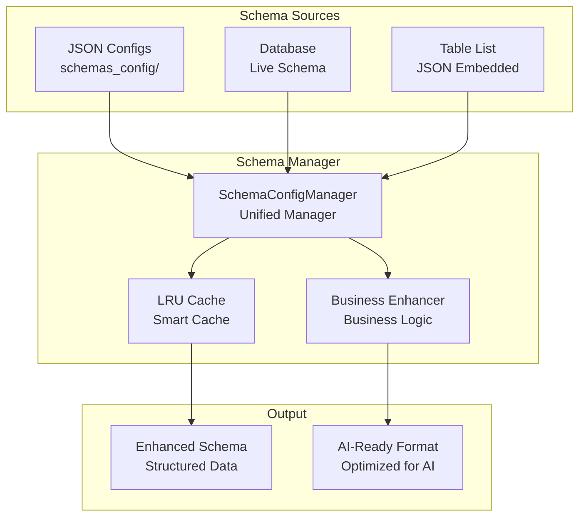

# Schema System

The Schema system provides a pure JSON configuration approach for managing database metadata, enabling AI to understand business logic through structured configuration files.

## System Overview

### Core Features
- **Fully generic**: Zero hardcoded design, works with any database structure
- **Pure JSON system**: Flexible management based on JSON configuration
- **LRU cache**: High-performance lazy loading and caching
- **Hot reload**: Configuration updates without service restart
- **Smart enhancement**: Dynamic business logic mapping and semantic understanding

### Architecture


---

## Configuration Structure

### Directory Layout
```
schemas_config/
├── README.md                # System documentation
├── SCHEMA_CONFIG_GUIDE.md   # Complete guide
├── tables_list.json         # Main config: table whitelist
├── global_patterns.json     # Global column patterns
├── ai_enhancement.json      # AI enhancement config
├── examples/                # Reference examples
│   ├── sample_table.json    # Complete table config example
│   └── README.md            # Example usage guide
└── tables/                  # Individual table configs
    └── .gitkeep             # (add your table configs here)
```

### Source Priority
| Source | Location | Purpose | Priority |
|--------|----------|---------|----------|
| **JSON Config** | `schemas_config/` | Business logic and descriptions | Highest |
| **Table List** | `tables_list.json` | Basic table listing (JSON embedded) | Medium |
| **Live Database** | Real-time query | Latest database structure | Dynamic |

---

## Configuration Files

### 1. Main Config (`tables_list.json`)

```json
{
  "metadata": {
    "version": "2.1",
    "description": "Schema main configuration"
  },
  "table_categories": {
    "core": {
      "display_name": "Core Business Tables",
      "tables": ["ORDERS", "ORDER_ITEMS", "CUSTOMERS"]
    }
  },
  "tables": {
    "ORDERS": {"table_type": "TABLE", "display_name": "Orders"},
    "ORDER_ITEMS": {"table_type": "TABLE", "display_name": "Order Items"},
    "CUSTOMERS": {"table_type": "TABLE", "display_name": "Customers"}
  }
}
```

### 2. Global Patterns (`global_patterns.json`)

```json
{
  "column_patterns": {
    "_ID$": {
      "semantic_type": "identifier",
      "default_description": "Identifier",
      "business_hints": "Primary or foreign key for joins"
    },
    "_DATE$|_TIME$": {
      "semantic_type": "datetime",
      "default_description": "Date/Time",
      "business_hints": "Time-related field"
    },
    "_PRICE$|_AMOUNT$": {
      "semantic_type": "money",
      "default_description": "Amount",
      "business_hints": "Financial calculation field"
    },
    "_QTY$|_COUNT$": {
      "semantic_type": "quantity",
      "default_description": "Quantity",
      "business_hints": "Counting field"
    }
  },
  "time_patterns": {
    "current_month": {
      "sql_server": "MONTH({date_column}) = MONTH(GETDATE())",
      "postgresql": "DATE_TRUNC('month', {date_column}) = DATE_TRUNC('month', CURRENT_DATE)"
    }
  }
}
```

### 3. AI Enhancement (`ai_enhancement.json`)

```json
{
  "query_patterns": {
    "order_analysis": {
      "keywords": ["order", "purchase", "revenue"],
      "primary_tables": ["ORDERS", "ORDER_ITEMS"],
      "sample_queries": ["Today's order total", "Top products by revenue"]
    }
  },
  "natural_language_mappings": {
    "chinese_keywords": {
      "today": "DATE(ORDER_DATE) = CURRENT_DATE",
      "this_month": "DATE_TRUNC('month', ORDER_DATE) = DATE_TRUNC('month', CURRENT_DATE)"
    }
  }
}
```

### 4. Table Config (`tables/ORDERS.json`)

See `schemas_config/examples/sample_table.json` for a complete reference with all available fields.

```json
{
  "table_name": "ORDERS",
  "display_name": "Orders",
  "business_importance": "critical",
  "relationships": {
    "parent_tables": {
      "CUSTOMERS": {
        "join_condition": "ORDERS.CUSTOMER_ID = CUSTOMERS.CUSTOMER_ID",
        "relationship_type": "many_to_one"
      }
    },
    "child_tables": {
      "ORDER_ITEMS": {
        "join_condition": "ORDERS.ORDER_ID = ORDER_ITEMS.ORDER_ID",
        "relationship_type": "one_to_many"
      }
    }
  },
  "key_columns": {
    "ORDER_ID": {
      "semantic_type": "primary_key",
      "business_importance": "critical",
      "description": "Order unique identifier"
    },
    "ORDER_DATE": {
      "semantic_type": "date",
      "business_importance": "high",
      "description": "Order date"
    },
    "TOTAL_AMOUNT": {
      "semantic_type": "money",
      "business_importance": "high",
      "description": "Order total amount"
    }
  },
  "business_logic": {
    "calculations": {
      "total_amount": {
        "formula": "UNIT_PRICE * QTY",
        "description": "Line item total"
      }
    }
  }
}
```

---

## API Usage

### Basic Usage
```python
from src.database.schema.static_loader import get_schema_manager

manager = get_schema_manager()

# Get table Schema
table_schema = manager.get_table_schema("ORDERS")

# List all tables
all_tables = manager.get_all_tables()

# Get system summary
summary = manager.get_summary()
```

### Advanced Operations
```python
# Get AI enhancement config
ai_config = manager.get_ai_enhancement_config()

# Get global patterns
global_patterns = manager.get_global_patterns()

# Hot reload
manager.reload_configs()

# Clear cache
manager.clear_cache()
```

---

## Performance

### LRU Cache
```python
# SchemaConfigManager has built-in instance caching
# Most recently accessed table schemas are cached in memory
```

### Lazy Loading
- **On-demand loading**: Only loads specific table schema when requested
- **Smart preload**: Configurable preload for important tables
- **Incremental update**: Partial config update without full reload

---

## Best Practices

1. **Semantic types**: Define clear semantic types for each column
2. **Business importance**: Mark field importance levels
3. **Relationships**: Define clear table relationships with JOIN conditions
4. **AI enhancement**: Map business keywords to database fields
5. **Use global patterns**: Reduce repetitive per-table definitions

---

> **Related docs**:
> - [Architecture](architecture.md) - System architecture
> - [Performance](performance.md) - Cache and optimization
> - [API Reference](api-reference.md) - Complete API docs
